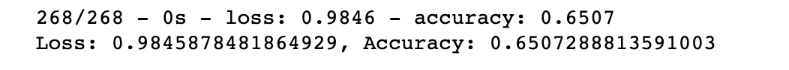
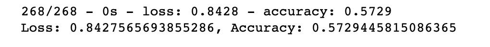
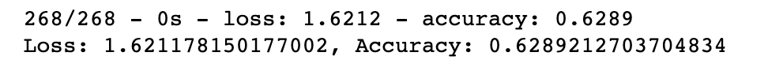
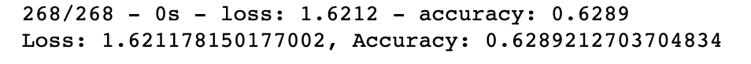

# Neural_Network_Charity_Analysis

From Alphabet Soup’s business team, Beks received a CSV containing more than 34,000 organizations that have received funding from Alphabet Soup over the years. Alphabet Soup has  raised and donated $10 billion in the past 20 years.
There have been cases in the past where a borrowing organization has disappeared with the funds. Alphabet wants to run analysis on its data to determine what organization is worth donating to and which are too high-risk. We are going to use deep learning models to determine which organizations should receive donations.

Result:

Data Preprocessing
- is_successful is the target outcome
- We consider all the fields in the file to be a feature except EIN and NAME. 
- The EIN, NAME features have no effect on the outcome and were removed
- We want to determine the IS_SUCCESSFUL binary outcome

Compiling, Training, and Evaluating the Model

Original Model: 

The number of inputs = number of features.

number of neurons in the 1st layer = 80

number of neurons in the 2nd layer = 30

I tried the below settings for the model

First Model: 

The number of inputs = number of features.

number of neurons in the 1st layer = 120

number of neurons in the 2nd layer = 30

Second Model: 

The number of inputs = number of features.

number of neurons in the 1st layer = 4* number of features

number of neurons in the 2nd layer = number of features/2

Third Model :same as Second model increasing the layers.

The number of inputs = number of features.

number of neurons in the 1st layer = 5 * number of features

number of neurons in the 2nd layer = 5 * number of features

number of neurons in the 3rd layer = number of features/2

It shows that increasing the data had a positive impact on  accuracy but increasing the layer did not affect on accuracy as it makes the process complicated.

Summary:

To have the best performance we need more data in compare to other features. 